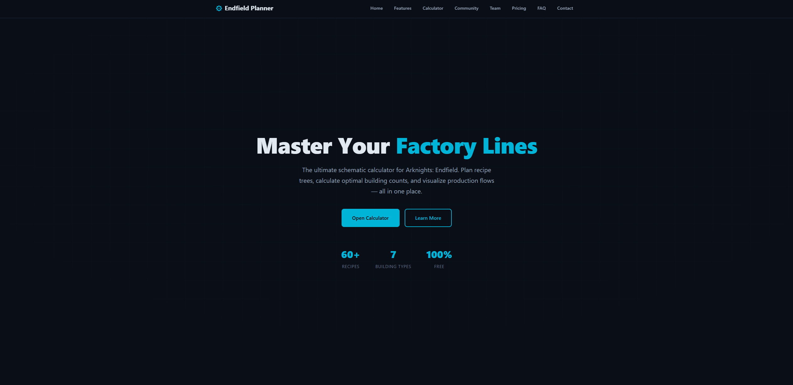
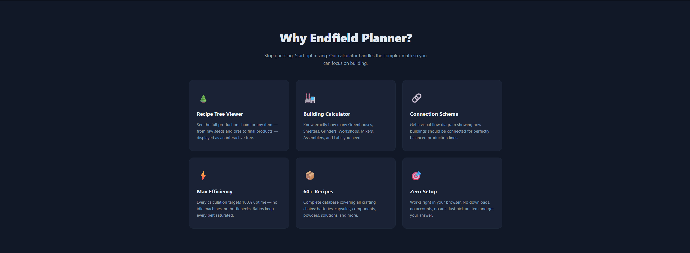
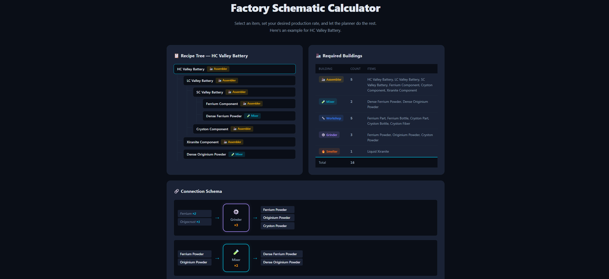
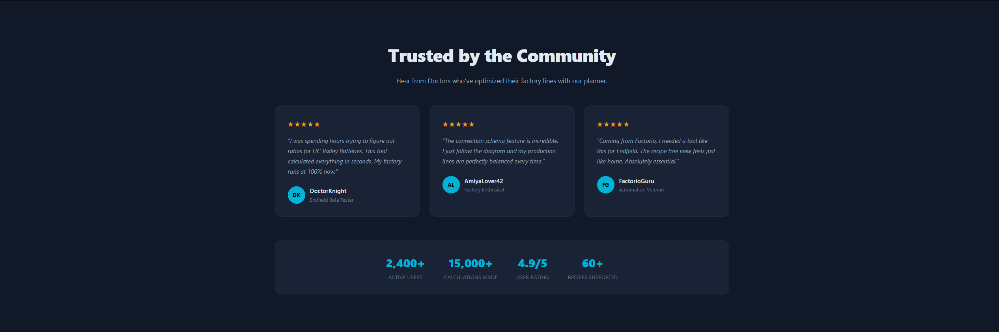
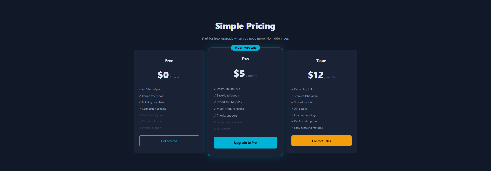
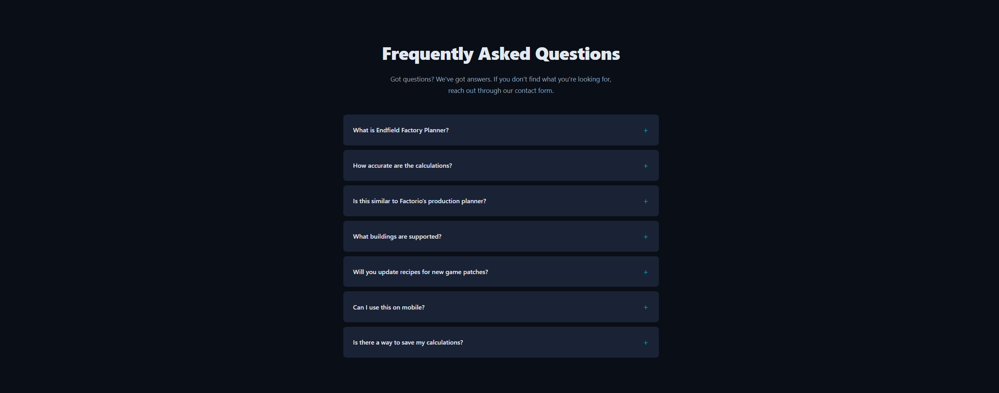

# Endfield Factory Planner — Landing Page

A landing page for **Endfield Factory Planner**, a schematic calculator tool for **Arknights: Endfield**. The factory mechanic in Endfield is similar to Factorio — players build production chains with different building types to craft items.

## What it does

The planner helps players:

- View **recipe trees** showing full production chains for any item
- Calculate the **exact number of buildings** (Greenhouse, Grinder, Smelter, Workshop, Mixer, Assembler, Chemical Lab) needed for max-efficiency production
- Generate a **connection schema** showing how buildings should be linked together

## Sections

1. **Hero** — Headline, value proposition, and CTA
2. **Features** — Six key capabilities of the tool
3. **Calculator Showcase** — Static demo of a recipe tree, building summary, and connection schema for HC Valley Battery, plus the full recipe database (60+ items)
4. **Testimonials** — Community social proof with trust metrics
5. **Team** — The people behind the project
6. **Pricing** — Free / Pro / Team tiers
7. **FAQ** — Common questions answered with native HTML accordions
8. **Contact** — Contact form and support channels
9. **Footer** — Navigation links and legal

## Tech Stack

- Vanilla **HTML** and **CSS** only — no frameworks, no JavaScript
- CSS custom properties for theming
- Fully responsive (mobile-first breakpoints)
- Native `
` / `
` for FAQ accordion (no JS needed)

## Live Demo

> _Link to deployed site will be added here_

## Screenshots

### Hero

### Features

### Calculator Showcase

### Testimonials

### About Me

### Pricing

### FAQ

### Contact & Footer

