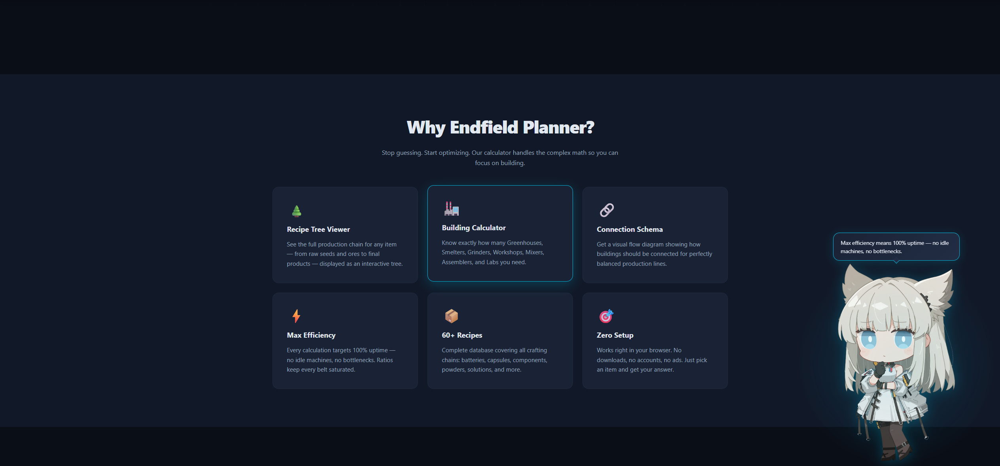
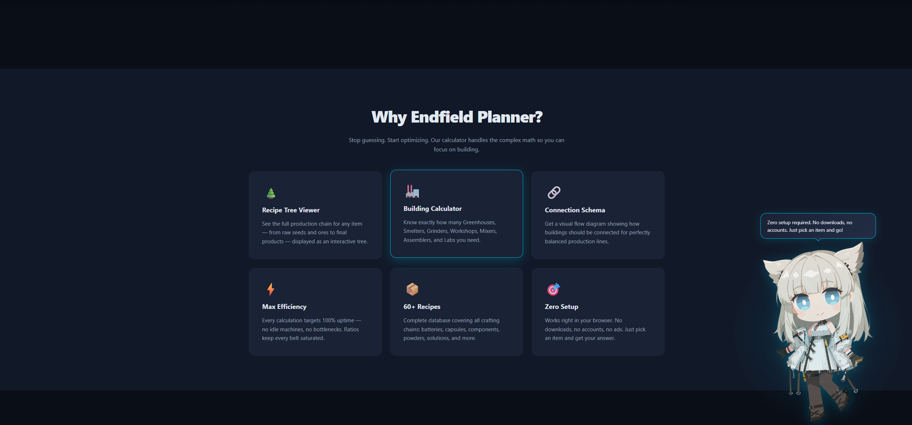
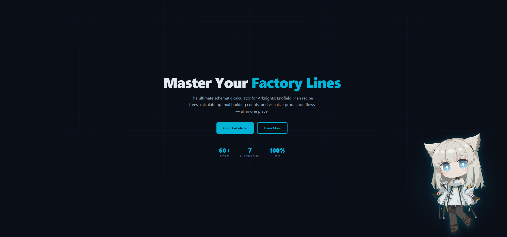

# Endfield Factory Planner — Lab 3: Responsive Design & Mascot

An improved version of the **Endfield Factory Planner** landing page, adding full responsive design, a Clippy-style mascot character, and a migration to **TailwindCSS v4** via **Vite**.

## What's New in Lab 3

- **Fully responsive layout** — all sections adapt from mobile to desktop using Tailwind breakpoints (`sm`, `md`, `lg`) and fluid `clamp()` typography
- **Mobile-only elements** — a Quick Start Banner and a floating CTA button visible only on small screens
- **Perlica mascot** — a Clippy-style assistant character from *Arknights: Endfield* that appears in the bottom-right corner after a 3-second delay
- **TailwindCSS v4** — full CSS framework migration using `@import "tailwindcss"` and a CSS-first `@theme` config, bundled with Vite

## Mascot — Perlica

Perlica is the Endfield Industries Supervisor from *Arknights: Endfield*, making her a natural fit as the assistant mascot for a factory planning tool.

**Behavior:**
- Slides in from the bottom-right after 3 seconds with a spring animation
- Greets the user on arrival with an in-character voiceline
- Detects which section the user's cursor is over and comments on it — recipe calculator, features, pricing, FAQ, and more
- Uses three distinct expressions — **smile**, **thinking**, and **teeth** — each matched to the tone of the line being spoken
- Animated floating motion (bob up and down) and a glow pulse beneath the sprite
- Talking animation cycles through closed → open → half-open frames with varied timing to mimic natural speech rhythm
- Chat bubble centered above the character with a pointed arrow

**Expressions:**
- `smile` — greetings and positive feature highlights
- `thinking` — calculator tips, factory logic, analytical observations
- `teeth` — neutral informational lines

## Sections

1. **Hero** — Headline, stats, and CTA buttons
2. **Mobile Quick Start Banner** — Mobile-only section with a jump-to-calculator link
3. **Features** — Six core capabilities of the planner
4. **Calculator Showcase** — Recipe tree, building summary table, and connection schema for HC Valley Battery, plus the full 60+ item recipe database
5. **Testimonials** — Community social proof with trust metrics
6. **Team** — Solo developer profile
7. **Pricing** — Free / Pro / Team tiers
8. **FAQ** — Accordion-style questions with native `
` elements
9. **Contact** — Contact form and support channels
10. **Footer** — Navigation links and legal

## Tech Stack

- **TailwindCSS v4** — utility-first CSS framework, CSS-first configuration with `@theme`
- **Vite** — build tool and dev server (`npm run dev`, `npm run build`)
- Vanilla **JavaScript** — mascot system, section detection via `mousemove`, mouth animation with chained `setTimeout`
- Fully responsive — mobile-first breakpoints, fluid typography with `clamp()`
- Native `
` / `
` for FAQ accordion

## Live Demo

> [Link to deployed site](https://ekkusuu.github.io/web-repo/lab3/)

## Screenshots

### Mascot — Greeting

### Mascot — Talking

### Mascot — Expression

