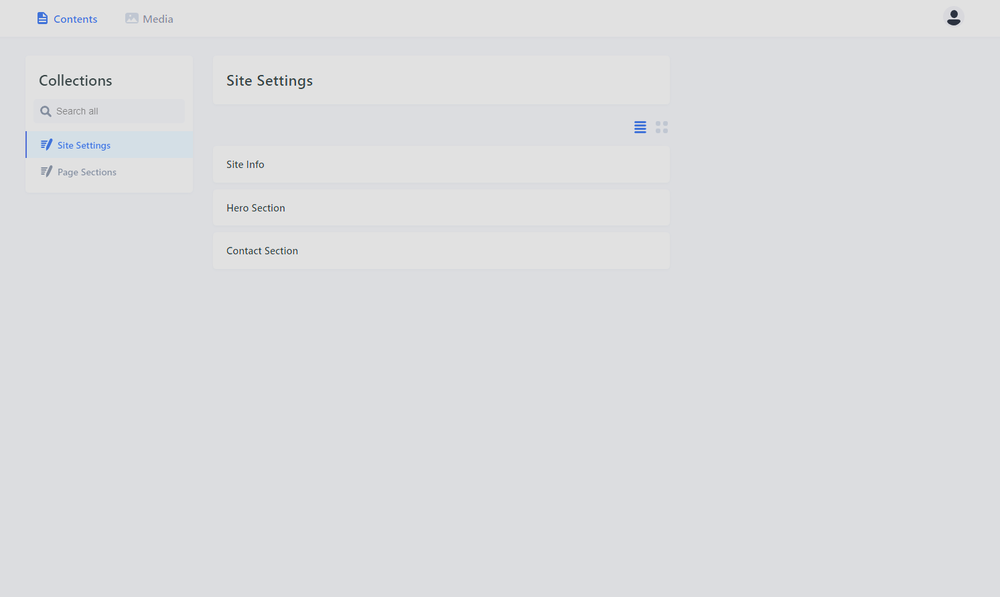
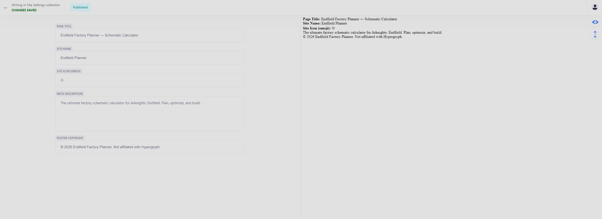
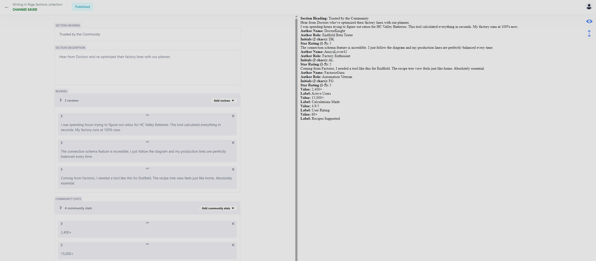

# Endfield Factory Planner — Lab 4: Static Site Generator & Git-based CMS

A migration of the **Endfield Factory Planner** landing page from a plain Vite + HTML setup to **Astro** as a Static Site Generator, with **Decap CMS** integrated as a Git-based content management system.

## What's New in Lab 4

- **Astro SSG** — the entire site is now built with Astro, replacing the single-file Vite setup from Lab 3
- **Component-based layout** — a reusable `Layout.astro` component handles the nav, footer, mascot, and all shared scripts; `index.astro` composes the page sections
- **CMS data layer** — all editable content (headings, feature cards, reviews, pricing plans, FAQ items, etc.) is extracted into JSON files under `src/data/`
- **Decap CMS** — a Git-based CMS admin panel at `/admin/` lets you edit all content through a web UI; changes are committed directly to the repository
- **Local CMS backend** — `decap-server` runs alongside Astro dev for instant local edits without touching GitHub
- **Tailwind CSS v4** — same CSS framework and theme from Lab 3, now wired through Astro's Vite plugin

## CMS — Decap CMS

The admin panel is accessible at `http://localhost:4321/admin/` during development.

**Collections:**

| Collection | Files |
|---|---|
| **Site Settings** | Site Info, Hero Section, Contact Section |
| **Page Sections** | Features, Testimonials, Team, Pricing, FAQ |

Each field maps directly to a JSON file in `src/data/`. When you publish a change in the CMS:
- In local dev (`npm run dev:cms`): `decap-server` writes the change to your local JSON files and Astro HMR reloads the page instantly
- On GitHub: changes are committed to the `lab4` branch as a regular git commit

**Running locally with CMS:**
```bash
npm run dev:cms
```
This starts both `astro dev` (port 4321) and `decap-server` (port 8081) concurrently.

## Sections

1. **Hero** — Headline, stats, and CTA buttons
2. **Mobile Quick Start Banner** — Mobile-only section with a jump-to-calculator link
3. **Features** — Six core capabilities of the planner
4. **Calculator Showcase** — Recipe tree, building summary table, and connection schema for HC Valley Battery, plus the full 60+ item recipe database
5. **Testimonials** — Community social proof with trust metrics
6. **Team** — Solo developer profile
7. **Pricing** — Free / Pro / Team tiers
8. **FAQ** — Accordion-style questions with native `<details>` elements
9. **Contact** — Contact form and support channels
10. **Footer** — Navigation links and legal

## Tech Stack

- **Astro 5** — Static Site Generator, file-based routing, component layouts
- **Decap CMS 3** — Git-based headless CMS, admin UI at `/admin/`, JSON collections
- **Tailwind CSS v4** — utility-first CSS framework, CSS-first configuration with `@theme`, via `@tailwindcss/vite`
- **decap-server** — local proxy for CMS edits without GitHub round-trips
- **concurrently** — runs Astro and decap-server together with `npm run dev:cms`
- Vanilla **TypeScript** (in Astro script blocks) — mascot system, section detection, mouth animation

## Project Structure

```
lab4/
├── public/
│   ├── admin/
│   │   └── config.yml        # Decap CMS collection definitions
│   └── mascot/               # Perlica sprite PNGs
├── src/
│   ├── data/                 # CMS-editable JSON content files
│   │   ├── site.json
│   │   ├── hero.json
│   │   ├── features.json
│   │   ├── testimonials.json
│   │   ├── team.json
│   │   ├── pricing.json
│   │   ├── faq.json
│   │   └── contact.json
│   ├── layouts/
│   │   └── Layout.astro      # Shared nav, footer, mascot, scripts
│   ├── pages/
│   │   ├── index.astro       # Main landing page
│   │   └── admin/
│   │       └── index.astro   # Decap CMS admin UI
│   └── styles/
│       └── global.css        # Tailwind v4 theme + custom CSS
└── package.json
```

## Live Demo

> [Link to deployed site](https://ekkusuu.github.io/web-repo/lab4/)

## Screenshots

### CMS Admin 





